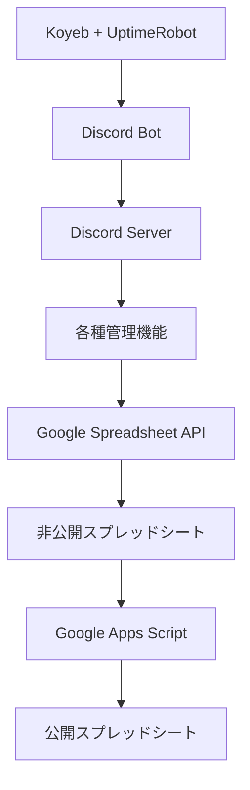

# ✏️ Sakumon Discord Bot

阪大作問サークルの活動をサポートするDiscord Botプロジェクトです。
サークル運営に必要な事務作業を自動化し、メンバーの活動をより円滑にすることを目指しています。

> [!IMPORTANT]
> このリポジトリではプロジェクトの概要・マニュアルを公開しています。
> セキュリティ上の理由から、実際のソースコードは非公開のプライベートリポジトリで管理しています。
> 開発に興味があるメンバーは、阪大作問サークルDIscordの**Bot管理チャンネル**までご連絡ください。

> [!NOTE]
> - [投票機能 マニュアル](./投票機能%20マニュアル.pdf)
> - [経費申請 マニュアル](./経費申請%20マニュアル.pdf)

## 🌟 概要

このBotは、サークル運営における以下の課題を解決するために開発されました：
- 経費申請・売上管理・事務作業の煩雑であること
- 経費申請プロセスが統一されておらず曖昧であること
- サークル費が不透明であること
- サークル全体で情報が統一できていないこと

## ✨ 主な機能

### 💰 経費管理システム
- 経費申請の電子化
  - 「経費申請」チャンネルでの申請
  - スプレッドシートとの自動連携
- 年会費管理の効率化
- 申請の未完了通知
- 経費承認フロー
  1. 「経費申請」チャンネルで申請
  2. 経費承認者がスタンプでリアクション（承認、却下、再審査）
  3. スタンプに応じて処理実行
  4. DMに結果送信

### 📈 売上管理システム
- 売上データの一元管理
- 自動集計機能

### 🗳️ 投票機能システム
- 投票の作成
- 自動で未投票者への催促
- 投票結果の記録
- 投票結果に基づく自動アクション
- 進行中の投票の一元管理

### 👥 メンバー管理
- メンバー情報の一元管理
- 権限管理の自動化
- サークル費の支払い有無の管理
- 活動状況の管理

## 🛠 技術スタック

- **プラットフォーム**: Discord
- **開発言語**: Python 
- **主要技術**:
  - Discord.py (Discord Bot Framework)
  - Google Spreadsheet API (データ管理)
  - Koyebによるクラウドホスティング
  - UptimeRobotによる常時起動監視

## 📊 システム構成

## 🎯 プロジェクトの目標
- 事務作業の自動化
- 人的ミスの削減
- 使いやすいインターフェース
- メンバー管理の効率化
- 資金の透明性の向上

## 📈 プロジェクト規模
- 開発期間：2025年7月〜
- 利用規模：約40名のサークルメンバー
- 運用期間：2025年8月〜

## 🔄 今後の展望
- データベース連携による機能拡張
- 経費承認フローの改善
- 統計機能の追加

## 👥 開発チーム

阪大作問サークルによって開発・運営されています。

## 📝 ライセンス

このプロジェクトは非公開です。すべての権利は阪大作問サークルに帰属します。